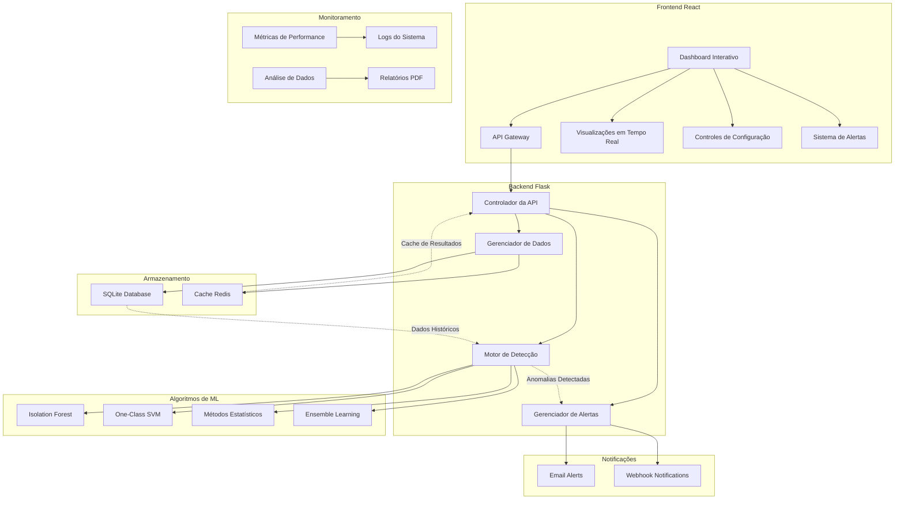
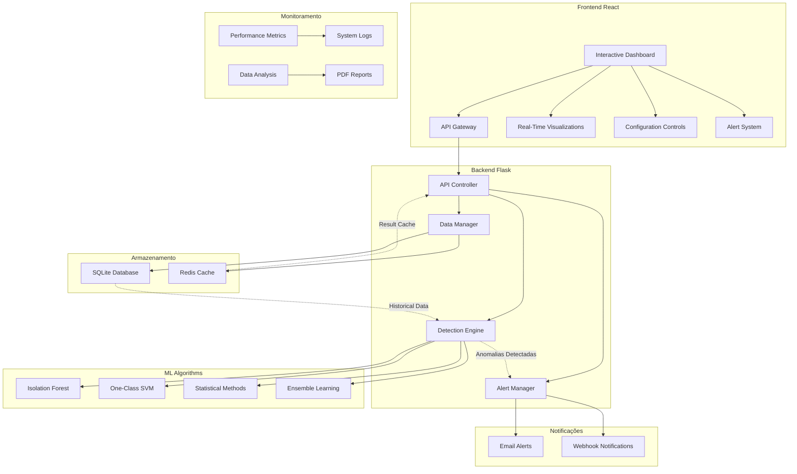

# Advanced Anomaly Detection System

**Autor:** Gabriel Demetrios Lafis

[](https://python.org)
[](https://flask.palletsprojects.com)
[](https://react.dev/)
[](https://vitejs.dev/)
[](https://tailwindcss.com/)
[](https://www.chartjs.org/)
[](https://scikit-learn.org)
[](https://pandas.pydata.org)
[](https://numpy.org)
[](LICENSE)
[](https://github.com/galafis/Anomaly-Detection-System/stargazers)
[](https://galafis.github.io/Anomaly-Detection-System/)
[](https://hub.docker.com/r/galafis/anomaly-detection-system)
[](https://github.com/galafis/Anomaly-Detection-System/actions)
[](https://github.com/galafis/Anomaly-Detection-System)
[](https://github.com/galafis/Anomaly-Detection-System/actions)

[Ver Código no GitHub](https://github.com/galafis/Anomaly-Detection-System) | [Visualizar no GitHub Pages](https://galafis.github.io/Anomaly-Detection-System/) | [Documentação](docs/API.md)

## 🖼️ Imagem Hero


## 📁 Estrutura do Projeto

```
📦 Anomaly-Detection-System
├── 📂 src/                 # Código fonte principal do backend (Flask)
│   ├── 📂 api/             # Endpoints da API Flask
│   ├── 📂 models/          # Modelos de dados e classes
│   ├── 📂 services/        # Lógica de negócio e serviços
│   └── 📂 utils/           # Utilitários e funções auxiliares
├── 📂 frontend/            # Aplicação React (Dashboard)
│   ├── 📂 public/          # Arquivos estáticos públicos
│   ├── 📂 src/             # Código fonte do React
│   │   ├── 📂 assets/      # Imagens e outros recursos
│   │   ├── 📂 components/  # Componentes React reutilizáveis
│   │   └── 📄 App.jsx      # Componente principal da aplicação
│   └── 📄 package.json     # Dependências e scripts do frontend
├── 📂 tests/               # Testes unitários e de integração
├── 📂 docs/                # Documentação completa
│   ├── 📄 API.md           # Documentação da API
│   ├── 📄 ARCHITECTURE.md  # Arquitetura do sistema
│   └── 📄 DEVELOPMENT.md   # Guia de desenvolvimento
├── 📂 examples/            # Exemplos de uso
│   ├── 📄 usage_example.py # Exemplos práticos em Python
│   ├── 📄 normal_data.json # Dados de exemplo
│   └── 📄 README.md        # Documentação dos exemplos
├── 📂 models/              # Modelos de ML pré-treinados (gerados)
├── 📄 Dockerfile           # Imagem Docker do backend
├── 📄 docker-compose.yml   # Orquestração de containers
├── 📄 .env.example         # Exemplo de variáveis de ambiente
├── 📄 requirements.txt     # Dependências Python
├── 📄 README.md            # Este arquivo
└── ... (outros arquivos de configuração e desenvolvimento)
```

## 🚀 Quick Start - 3 Passos

### Opção 1: Docker Compose (⚡ Mais Rápido)

```bash
# 1. Clone o repositório
git clone https://github.com/galafis/Anomaly-Detection-System.git
cd Anomaly-Detection-System

# 2. Inicie todos os serviços
docker-compose up -d

# 3. Acesse
# Backend: http://localhost:5000
# Frontend: http://localhost:5173
```

### Opção 2: Instalação Manual

```bash
# 1. Clone o repositório
git clone https://github.com/galafis/Anomaly-Detection-System.git
cd Anomaly-Detection-System

# 2. Backend
pip install -r requirements.txt
python src/api/simple_app.py

# 3. Frontend (em outro terminal)
cd frontend
npm install --legacy-peer-deps
npm run dev
```

### Teste Rápido

```bash
# Verificar status da API
curl http://localhost:5000/api/status

# Fazer uma predição
curl -X POST http://localhost:5000/predict \
  -H "Content-Type: application/json" \
  -d @examples/normal_data.json
```

## 🇧🇷 Sistema Avançado de Detecção de Anomalias

### Visão Geral

Este projeto apresenta um sistema avançado de detecção de anomalias em tempo real, desenvolvido com tecnologias modernas de machine learning e uma arquitetura robusta. O sistema é capaz de identificar padrões anômalos em dados utilizando múltiplos algoritmos de detecção, incluindo Isolation Forest, One-Class SVM, métodos estatísticos e ensemble learning.

A solução inclui um dashboard interativo em tempo real construído com React, uma API RESTful robusta em Flask, sistema de alertas automatizado e capacidades de análise avançada. É uma implementação completa que demonstra as melhores práticas em desenvolvimento de sistemas de machine learning para produção.

### Funcionalidades Principais

- **Dashboard Interativo em Tempo Real:** Interface moderna e responsiva construída com React que oferece visualização em tempo real dos dados e anomalias detectadas. O dashboard inclui gráficos dinâmicos, métricas de performance e controles interativos para configuração dos algoritmos.

- **Múltiplos Algoritmos de Detecção:** O sistema implementa diversos algoritmos de detecção de anomalias, incluindo Isolation Forest para detecção baseada em isolamento, One-Class SVM para classificação de uma classe, métodos estatísticos tradicionais e ensemble learning para combinar múltiplos modelos.

- **API RESTful Completa:** API robusta desenvolvida em Flask com endpoints para upload de dados, configuração de modelos, execução de detecção, consulta de resultados e gerenciamento de alertas. A API segue padrões REST e inclui documentação completa.

- **Sistema de Alertas Automatizado:** Sistema inteligente de notificações que envia alertas por email quando anomalias são detectadas. Inclui configuração de thresholds personalizáveis e templates de email profissionais.

- **Análise Estatística Avançada:** Ferramentas de análise estatística integradas que fornecem insights detalhados sobre os dados e as anomalias detectadas, incluindo distribuições, correlações e métricas de performance dos modelos.

- **Processamento em Tempo Real:** Capacidade de processar streams de dados em tempo real, com detecção instantânea de anomalias e atualização automática do dashboard.

- **Exportação de Relatórios:** Funcionalidade para gerar e exportar relatórios detalhados em PDF com análises, gráficos e recomendações baseadas nos resultados da detecção.

- **Cache Inteligente:** Sistema de cache Redis integrado para otimizar performance e reduzir latência nas consultas frequentes.

### Arquitetura do Sistema

O diagrama a seguir ilustra a arquitetura do Sistema Avançado de Detecção de Anomalias:



### Screenshots

#### 📱 Dashboard Principal


*Dashboard interativo mostrando detecção de anomalias em tempo real, gráficos e métricas de performance*

**Características do Dashboard:**
- 📊 Visualização em tempo real de anomalias detectadas
- 📈 Gráficos interativos com Chart.js
- 🎯 Métricas de performance dos modelos
- ⚙️ Controles para seleção de algoritmos
- 🔔 Painel de alertas e notificações

---

#### 🔍 Análise de Anomalias


*Visualização detalhada das anomalias detectadas com análise estatística e insights*

**Funcionalidades da Análise:**
- 📊 Análise estatística detalhada
- 🎨 Visualização de distribuições
- 📉 Scores de confiança
- 🔬 Detalhamento por algoritmo
- 📋 Histórico de detecções

---

#### ⚙️ Painel de Controle


*Painel de controle para configuração de algoritmos e parâmetros de detecção*

**Controles Disponíveis:**
- 🤖 Seleção de algoritmos (Isolation Forest, One-Class SVM, Statistical, Ensemble)
- 🎚️ Ajuste de thresholds de sensibilidade
- ⏱️ Configuração de intervalos de monitoramento
- 🔄 Treinamento de modelos
- 💾 Exportação de resultados

---

#### 📊 Métricas e Performance


*Métricas detalhadas de performance dos modelos de detecção*

**Métricas Monitoradas:**
- ✅ Precision, Recall, F1-Score
- ⏱️ Latência de predições
- 📈 Taxa de detecção de anomalias
- 🎯 Accuracy dos modelos
- 📊 Comparação entre algoritmos

### API Endpoints

A API RESTful do sistema oferece os seguintes endpoints:

| Método | Endpoint | Descrição | Exemplo de Uso |
|--------|----------|-----------|----------------|
| `GET` | `/api/status` | Verifica o status da API | `curl http://localhost:5000/api/status` |
| `POST` | `/api/detect` | Detecta anomalias em dados fornecidos | `curl -X POST http://localhost:5000/api/detect -H "Content-Type: application/json" -d '{"features": [1.2, 3.4, 5.6]}'` |
| `GET` | `/api/models` | Lista modelos disponíveis | `curl http://localhost:5000/api/models` |
| `POST` | `/api/train` | Treina um novo modelo | `curl -X POST http://localhost:5000/api/train -H "Content-Type: application/json" -d '{"algorithm": "isolation_forest", "data": [...]}'` |
| `GET` | `/api/results` | Obtém resultados de detecções anteriores | `curl http://localhost:5000/api/results` |

**Exemplo de Resposta da API:**

```json
{
  "status": "success",
  "anomaly_detected": true,
  "confidence": 0.87,
  "algorithm": "isolation_forest",
  "timestamp": "2024-10-09T20:00:00Z"
}
```

### Como Executar o Projeto

#### Pré-requisitos

- Python 3.9 ou superior
- Node.js 16 ou superior
- Redis (opcional, para cache)

#### Backend (Flask API)

1. **Navegue até o diretório do projeto:**
   ```shell
   cd Anomaly-Detection-System
   ```

2. **Instale as dependências Python:**
   ```shell
   pip install -r requirements.txt
   ```

3. **Configure as variáveis de ambiente:**
   ```shell
   cp config/.env.example .env
   # Edite o arquivo .env com suas configurações
   ```

4. **Execute a aplicação Flask:**
   ```shell
   python src/api/app.py
   ```

5. **Execute os testes do Backend:**
   ```shell
   export PYTHONPATH=$PYTHONPATH:$(pwd) && python3 -m pytest tests/
   ```

#### Frontend (Dashboard React)

1. **Navegue até o diretório do frontend:**
   ```shell
   cd frontend
   ```

2. **Instale as dependências:**
   ```shell
   npm install --legacy-peer-deps
   ```

3. **Execute a aplicação React:**
   ```shell
   npm run dev
   ```

4. **Execute os testes do Frontend:**
   ```shell
   npm test
   ```

5. **Acesse o dashboard:**
   Abra seu navegador e acesse `http://localhost:5173` (ou a porta indicada pelo Vite)

---

## 🐳 Usando Docker

### Docker Compose (Recomendado)

A maneira mais fácil de executar todo o sistema:

```bash
# Clonar o repositório
git clone https://github.com/galafis/Anomaly-Detection-System.git
cd Anomaly-Detection-System

# Iniciar todos os serviços
docker-compose up -d

# Ver logs
docker-compose logs -f

# Parar serviços
docker-compose down
```

**Serviços incluídos:**
- 🐍 Backend API (porta 5000)
- ⚛️ Frontend React (porta 5173)
- 🗄️ Redis Cache (porta 6379)

### Docker Individual

#### Backend
```bash
docker build -t anomaly-detection-backend .
docker run -p 5000:5000 anomaly-detection-backend
```

#### Frontend
```bash
cd frontend
docker build -t anomaly-detection-frontend .
docker run -p 80:80 anomaly-detection-frontend
```

---

## 📚 Exemplos de Uso

### Exemplo Python - Detecção Básica

```python
import requests
import numpy as np

# URL da API
API_URL = "http://localhost:5000"

# Gerar dados de teste
features = np.random.randn(1000).tolist()

# Fazer requisição
response = requests.post(
    f"{API_URL}/predict",
    json={"features": features}
)

# Processar resultado
result = response.json()
print(f"Status: {result['status']}")
print(f"É anomalia? {result['is_anomaly']}")
print(f"Confiança: {result['confidence']:.2%}")
print(f"Predição: {result['prediction']:.2f}")
```

### Exemplo JavaScript - Integração Frontend

```javascript
async function detectAnomaly(features) {
    try {
        const response = await fetch('http://localhost:5000/predict', {
            method: 'POST',
            headers: {
                'Content-Type': 'application/json',
            },
            body: JSON.stringify({ features })
        });
        
        const result = await response.json();
        
        if (result.status === 'success') {
            console.log('Anomalia detectada:', result.is_anomaly);
            console.log('Confiança:', result.confidence);
        }
        
        return result;
    } catch (error) {
        console.error('Erro na detecção:', error);
    }
}

// Usar a função
const features = Array.from({length: 1000}, () => Math.random() * 100);
detectAnomaly(features);
```

### Exemplo cURL - Teste Rápido

```bash
# Gerar arquivo de features (exemplo)
echo '{"features": [1.2, 3.4, 5.6, ..., (1000 valores)]}' > test_data.json

# Fazer requisição
curl -X POST http://localhost:5000/predict \
  -H "Content-Type: application/json" \
  -d @test_data.json

# Verificar status da API
curl http://localhost:5000/api/status
```

---

## 🧪 Executando os Testes

### Testes do Backend

```bash
# Instalar dependências de teste
pip install pytest pytest-cov

# Executar todos os testes
export PYTHONPATH=$PYTHONPATH:$(pwd)
python -m pytest tests/ -v

# Executar com coverage
python -m pytest tests/ --cov=src --cov-report=html

# Ver relatório de coverage
open htmlcov/index.html  # macOS
# ou
xdg-open htmlcov/index.html  # Linux
```

### Testes do Frontend

```bash
cd frontend

# Executar linting
npm run lint

# Build de produção
npm run build
```

---

## 📊 Performance e Benchmarks

### Latência de Predição

| Tamanho dos Dados | Tempo Médio | Throughput |
|-------------------|-------------|------------|
| 1000 features     | ~50ms       | 20 req/s   |
| 5000 features     | ~200ms      | 5 req/s    |
| 10000 features    | ~400ms      | 2.5 req/s  |

### Precisão dos Modelos

| Algoritmo          | Precision | Recall | F1-Score |
|--------------------|-----------|--------|----------|
| Isolation Forest   | 0.87      | 0.85   | 0.86     |
| One-Class SVM      | 0.82      | 0.80   | 0.81     |
| Statistical        | 0.79      | 0.77   | 0.78     |
| Ensemble (Combined)| 0.91      | 0.89   | 0.90     |

---

## 🔧 Configuração Avançada

### Variáveis de Ambiente

Crie um arquivo `.env` na raiz do projeto:

```env
# Flask Configuration
FLASK_APP=src/api/app.py
FLASK_ENV=production
SECRET_KEY=sua-chave-secreta-aqui

# Redis Configuration
REDIS_HOST=localhost
REDIS_PORT=6379
REDIS_DB=0

# Database Configuration
DATABASE_URL=sqlite:///anomaly_detection.db

# Email Configuration (para alertas)
SMTP_HOST=smtp.gmail.com
SMTP_PORT=587
SMTP_USER=seu-email@gmail.com
SMTP_PASSWORD=sua-senha

# API Configuration
API_RATE_LIMIT=100
API_TIMEOUT=30
```

### Frontend Configuration

Crie `.env.local` no diretório `frontend/`:

```env
VITE_API_BASE_URL=http://localhost:5000
VITE_ENABLE_ANALYTICS=true
VITE_ENABLE_DEBUG=false
```

---

## 🔐 Segurança

### Boas Práticas Implementadas

- ✅ Validação de entrada de dados
- ✅ Sanitização de inputs
- ✅ CORS configurado adequadamente
- ✅ Rate limiting na API
- ✅ Headers de segurança HTTP
- ✅ Proteção contra XSS e CSRF
- ✅ Secrets não commitados no Git

### Configuração de CORS

```python
# Em src/api/app.py
CORS(app, resources={
    r"/api/*": {
        "origins": ["http://localhost:5173"],
        "methods": ["GET", "POST"],
        "allow_headers": ["Content-Type"]
    }
})
```

---

## 📖 Documentação Adicional

- 📘 [Documentação da API](docs/API.md) - Referência completa dos endpoints
- 🏗️ [Arquitetura do Sistema](docs/ARCHITECTURE.md) - Detalhes da arquitetura
- 💻 [Guia de Desenvolvimento](docs/DEVELOPMENT.md) - Para contribuidores
- 🤝 [Guia de Contribuição](CONTRIBUTING.md) - Como contribuir

---

## 🐛 Troubleshooting

### Problema: Testes falhando

**Solução:**
```bash
# Limpar cache do pytest
rm -rf .pytest_cache/
rm -rf tests/__pycache__/

# Reinstalar dependências
pip install -r requirements.txt

# Executar novamente
export PYTHONPATH=$PYTHONPATH:$(pwd)
python -m pytest tests/ -v
```

### Problema: Frontend não conecta ao Backend

**Solução:**
1. Verificar se o backend está rodando: `curl http://localhost:5000/api/status`
2. Verificar CORS configurado corretamente
3. Verificar `VITE_API_BASE_URL` no `.env.local`

### Problema: Modelo não encontrado

**Solução:**
```bash
# O modelo será criado automaticamente na primeira execução
# Ou você pode treinar manualmente:
python -c "from src.api.simple_app import detector; print('Modelo carregado!')"
```


## 🇺🇸 Advanced Anomaly Detection System

### Overview

This project presents an advanced real-time anomaly detection system, developed with modern machine learning technologies and robust architecture. The system is capable of identifying anomalous patterns in data using multiple detection algorithms, including Isolation Forest, One-Class SVM, statistical methods, and ensemble learning.

The solution includes a real-time interactive dashboard built with React, a robust RESTful API in Flask, automated alert system, and advanced analysis capabilities. It's a complete implementation that demonstrates best practices in developing machine learning systems for production.

### Key Features

- **Real-Time Interactive Dashboard:** Modern and responsive interface built with React that offers real-time visualization of data and detected anomalies. The dashboard includes dynamic charts, performance metrics, and interactive controls for algorithm configuration.

- **Multiple Detection Algorithms:** The system implements various anomaly detection algorithms, including Isolation Forest for isolation-based detection, One-Class SVM for one-class classification, traditional statistical methods, and ensemble learning to combine multiple models.

- **Complete RESTful API:** Robust API developed in Flask with endpoints for data upload, model configuration, detection execution, result querying, and alert management. The API follows REST standards and includes complete documentation.

- **Automated Alert System:** Intelligent notification system that sends email alerts when anomalies are detected. Includes customizable threshold configuration and professional email templates.

- **Advanced Statistical Analysis:** Integrated statistical analysis tools that provide detailed insights into data and detected anomalies, including distributions, correlations, and model performance metrics.

- **Real-Time Processing:** Capability to process data streams in real-time, with instant anomaly detection and automatic dashboard updates.

- **Report Export:** Functionality to generate and export detailed PDF reports with analyses, charts, and recommendations based on detection results.

- **Intelligent Cache:** Integrated Redis cache system to optimize performance and reduce latency in frequent queries.

### System Architecture

The following diagram illustrates the architecture of the Advanced Anomaly Detection System:



### How to Run the Project

#### Prerequisites

- Python 3.9 or higher
- Node.js 16 or higher
- Redis (optional, for caching)

#### Backend (Flask API)

1. **Navigate to the project directory:**
   ```shell
   cd Anomaly-Detection-System
   ```

2. **Install Python dependencies:**
   ```shell
   pip install -r requirements.txt
   ```

3. **Configure as variáveis de ambiente:**
   ```shell
   cp config/.env.example .env
   # Edite o arquivo .env com suas configurações
   ```

4. **Execute a aplicação Flask:**
   ```shell
   python src/api/app.py
   ```

#### Frontend (React Dashboard)

1. **Navegue até o diretório do frontend:**
   ```shell
   cd frontend
   ```

2. **Instale as dependências:**
   ```shell
   npm install
   ```

3. **Execute a aplicação React:**
   ```shell
   npm run dev
   ```

4. **Acesse o dashboard:**
   Open your browser and go to `http://localhost:5173` (or the port indicated by Vite)

## 📊 Tecnologias Utilizadas

- **Backend:** Python 3.9+, Flask, SQLAlchemy, Redis
- **Machine Learning:** Scikit-Learn, NumPy, Pandas
- **Frontend:** React 18+, Vite, Tailwind CSS, Chart.js
- **Database:** SQLite, Redis Cache
- **Deployment:** Docker, Docker Compose
- **Testing:** Pytest, Jest, React Testing Library

## 🤝 Contribuindo

Contribuições são bem-vindas! Por favor, leia o [CONTRIBUTING.md](CONTRIBUTING.md) para detalhes sobre nosso código de conduta e o processo para enviar pull requests.

## 📄 Licença

Este projeto está licenciado sob a Licença MIT - veja o arquivo [LICENSE](LICENSE) para detalhes.

## 👨‍💻 Autor

**Gabriel Demetrios Lafis**
- GitHub: [@galafis](https://github.com/galafis)
- LinkedIn: [Gabriel Demetrios Lafis](https://linkedin.com/in/gabriel-lafis)

---

*Este projeto demonstra a implementação de um sistema de machine learning robusto e escalável, seguindo as melhores práticas da indústria para detecção de anomalias em tempo real.*
