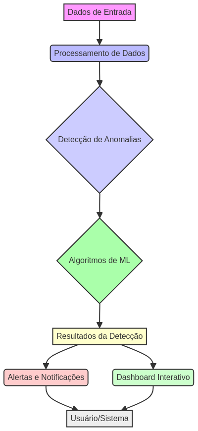
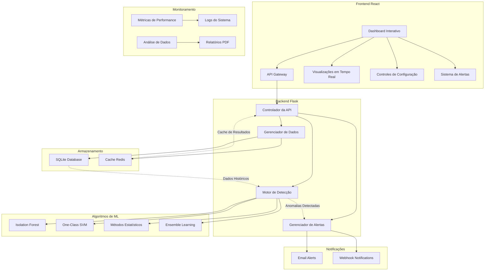
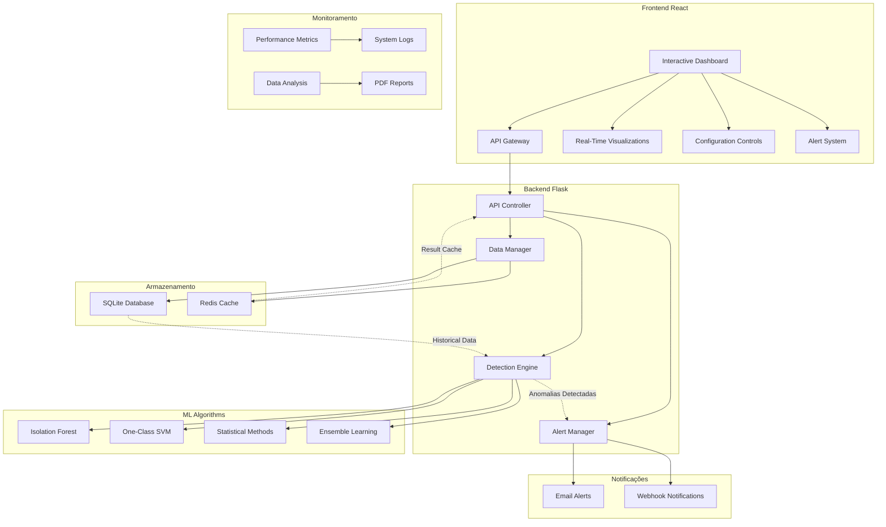

# Advanced Anomaly Detection System

**Autor:** Gabriel Demetrios Lafis

[](https://python.org)
[](https://flask.palletsprojects.com)
[](https://react.dev/)
[](https://vitejs.dev/)
[](https://tailwindcss.com/)
[](https://www.chartjs.org/)
[](https://scikit-learn.org)
[](https://pandas.pydata.org)
[](https://numpy.org)
[](LICENSE)
[](https://github.com/galafis/Anomaly-Detection-System/stargazers)
[](https://galafis.github.io/Anomaly-Detection-System/)
[](https://hub.docker.com/r/galafis/anomaly-detection-system)

[Ver Código no GitHub](https://github.com/galafis/Anomaly-Detection-System) | [Visualizar no GitHub Pages](https://galafis.github.io/Anomaly-Detection-System/)

## 🖼️ Imagem Hero



## 📁 Estrutura do Projeto

```
📦 Anomaly-Detection-System
├── 📂 src/                 # Código fonte principal do backend (Flask)
│   ├── 📂 api/             # Endpoints da API Flask
│   ├── 📂 models/          # Modelos de dados e classes
│   ├── 📂 services/        # Lógica de negócio e serviços
│   └── 📂 utils/           # Utilitários e funções auxiliares
├── 📂 frontend/            # Aplicação React (Dashboard)
│   ├── 📂 public/          # Arquivos estáticos públicos
│   ├── 📂 src/             # Código fonte do React
│   │   ├── 📂 assets/      # Imagens e outros recursos
│   │   ├── 📂 components/  # Componentes React reutilizáveis
│   │   └── 📄 App.jsx      # Componente principal da aplicação
│   └── 📄 package.json     # Dependências e scripts do frontend
├── 📂 models/              # Modelos de ML pré-treinados (gerados)
├── 📄 .env.example         # Exemplo de variáveis de ambiente
├── 📄 requirements.txt     # Dependências Python
├── 📄 README.md            # Este arquivo
└── ... (outros arquivos de configuração e desenvolvimento)
```

## 🇧🇷 Sistema Avançado de Detecção de Anomalias

### Visão Geral

Este projeto apresenta um sistema avançado de detecção de anomalias em tempo real, desenvolvido com tecnologias modernas de machine learning e uma arquitetura robusta. O sistema é capaz de identificar padrões anômalos em dados utilizando múltiplos algoritmos de detecção, incluindo Isolation Forest, One-Class SVM, métodos estatísticos e ensemble learning.

A solução inclui um dashboard interativo em tempo real construído com React, uma API RESTful robusta em Flask, sistema de alertas automatizado e capacidades de análise avançada. É uma implementação completa que demonstra as melhores práticas em desenvolvimento de sistemas de machine learning para produção.

### Funcionalidades Principais

- **Dashboard Interativo em Tempo Real:** Interface moderna e responsiva construída com React que oferece visualização em tempo real dos dados e anomalias detectadas. O dashboard inclui gráficos dinâmicos, métricas de performance e controles interativos para configuração dos algoritmos.

- **Múltiplos Algoritmos de Detecção:** O sistema implementa diversos algoritmos de detecção de anomalias, incluindo Isolation Forest para detecção baseada em isolamento, One-Class SVM para classificação de uma classe, métodos estatísticos tradicionais e ensemble learning para combinar múltiplos modelos.

- **API RESTful Completa:** API robusta desenvolvida em Flask com endpoints para upload de dados, configuração de modelos, execução de detecção, consulta de resultados e gerenciamento de alertas. A API segue padrões REST e inclui documentação completa.

- **Sistema de Alertas Automatizado:** Sistema inteligente de notificações que envia alertas por email quando anomalias são detectadas. Inclui configuração de thresholds personalizáveis e templates de email profissionais.

- **Análise Estatística Avançada:** Ferramentas de análise estatística integradas que fornecem insights detalhados sobre os dados e as anomalias detectadas, incluindo distribuições, correlações e métricas de performance dos modelos.

- **Processamento em Tempo Real:** Capacidade de processar streams de dados em tempo real, com detecção instantânea de anomalias e atualização automática do dashboard.

- **Exportação de Relatórios:** Funcionalidade para gerar e exportar relatórios detalhados em PDF com análises, gráficos e recomendações baseadas nos resultados da detecção.

- **Cache Inteligente:** Sistema de cache Redis integrado para otimizar performance e reduzir latência nas consultas frequentes.

### Arquitetura do Sistema

O diagrama a seguir ilustra a arquitetura do Sistema Avançado de Detecção de Anomalias:



### Como Executar o Projeto

#### Pré-requisitos

- Python 3.9 ou superior
- Node.js 16 ou superior
- Redis (opcional, para cache)

#### Backend (Flask API)

1. **Navegue até o diretório do projeto:**
   ```shell
   cd Anomaly-Detection-System
   ```

2. **Instale as dependências Python:**
   ```shell
   pip install -r requirements.txt
   ```

3. **Configure as variáveis de ambiente:**
   ```shell
   cp config/.env.example .env
   # Edite o arquivo .env com suas configurações
   ```

4. **Execute a aplicação Flask:**
   ```shell
   python src/api/app.py
   ```

#### Frontend (Dashboard React)

1. **Navegue até o diretório do frontend:**
   ```shell
   cd frontend
   ```

2. **Instale as dependências:**
   ```shell
   npm install
   ```

3. **Execute a aplicação React:**
   ```shell
   npm run dev
   ```

4. **Acesse o dashboard:**
   Abra seu navegador e acesse `http://localhost:5173` (ou a porta indicada pelo Vite)

## 🇺🇸 Advanced Anomaly Detection System

### Overview

This project presents an advanced real-time anomaly detection system, developed with modern machine learning technologies and robust architecture. The system is capable of identifying anomalous patterns in data using multiple detection algorithms, including Isolation Forest, One-Class SVM, statistical methods, and ensemble learning.

The solution includes a real-time interactive dashboard built with React, a robust RESTful API in Flask, automated alert system, and advanced analysis capabilities. It's a complete implementation that demonstrates best practices in developing machine learning systems for production.

### Key Features

- **Real-Time Interactive Dashboard:** Modern and responsive interface built with React that offers real-time visualization of data and detected anomalies. The dashboard includes dynamic charts, performance metrics, and interactive controls for algorithm configuration.

- **Multiple Detection Algorithms:** The system implements various anomaly detection algorithms, including Isolation Forest for isolation-based detection, One-Class SVM for one-class classification, traditional statistical methods, and ensemble learning to combine multiple models.

- **Complete RESTful API:** Robust API developed in Flask with endpoints for data upload, model configuration, detection execution, result querying, and alert management. The API follows REST standards and includes complete documentation.

- **Automated Alert System:** Intelligent notification system that sends email alerts when anomalies are detected. Includes customizable threshold configuration and professional email templates.

- **Advanced Statistical Analysis:** Integrated statistical analysis tools that provide detailed insights into data and detected anomalies, including distributions, correlations, and model performance metrics.

- **Real-Time Processing:** Capability to process data streams in real-time, with instant anomaly detection and automatic dashboard updates.

- **Report Export:** Functionality to generate and export detailed PDF reports with analyses, charts, and recommendations based on detection results.

- **Intelligent Cache:** Integrated Redis cache system to optimize performance and reduce latency in frequent queries.

### System Architecture

The following diagram illustrates the architecture of the Advanced Anomaly Detection System:



### How to Run the Project

#### Prerequisites

- Python 3.9 or higher
- Node.js 16 or higher
- Redis (optional, for caching)

#### Backend (Flask API)

1. **Navigate to the project directory:**
   ```shell
   cd Anomaly-Detection-System
   ```

2. **Install Python dependencies:**
   ```shell
   pip install -r requirements.txt
   ```

3. **Configure as variáveis de ambiente:**
   ```shell
   cp config/.env.example .env
   # Edite o arquivo .env com suas configurações
   ```

4. **Execute a aplicação Flask:**
   ```shell
   python src/api/app.py
   ```

#### Frontend (React Dashboard)

1. **Navegue até o diretório do frontend:**
   ```shell
   cd frontend
   ```

2. **Instale as dependências:**
   ```shell
   npm install
   ```

3. **Execute a aplicação React:**
   ```shell
   npm run dev
   ```

4. **Acesse o dashboard:**
   Open your browser and go to `http://localhost:5173` (or the port indicated by Vite)

## 📊 Tecnologias Utilizadas

- **Backend:** Python 3.9+, Flask, SQLAlchemy, Redis
- **Machine Learning:** Scikit-Learn, NumPy, Pandas
- **Frontend:** React 18+, Vite, Tailwind CSS, Chart.js
- **Database:** SQLite, Redis Cache
- **Deployment:** Docker, Docker Compose
- **Testing:** Pytest, Jest, React Testing Library

## 🤝 Contribuindo

Contribuições são bem-vindas! Por favor, leia o [CONTRIBUTING.md](CONTRIBUTING.md) para detalhes sobre nosso código de conduta e o processo para enviar pull requests.

## 📄 Licença

Este projeto está licenciado sob a Licença MIT - veja o arquivo [LICENSE](LICENSE) para detalhes.

## 👨‍💻 Autor

**Gabriel Demetrios Lafis**
- GitHub: [@galafis](https://github.com/galafis)
- LinkedIn: [Gabriel Demetrios Lafis](https://linkedin.com/in/gabriel-lafis)

---

*Este projeto demonstra a implementação de um sistema de machine learning robusto e escalável, seguindo as melhores práticas da indústria para detecção de anomalias em tempo real.*
