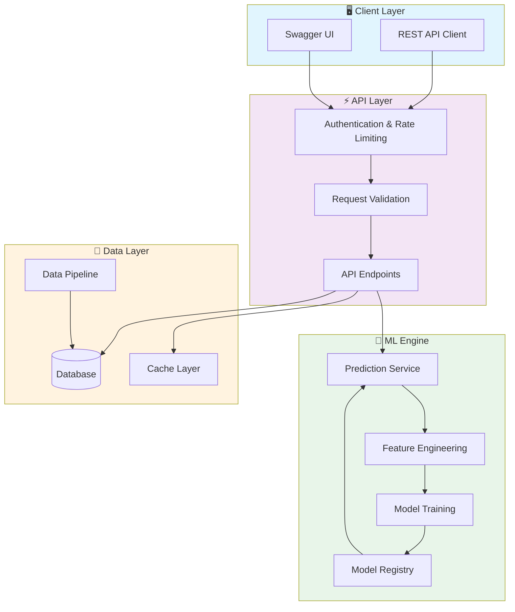

# 🚀 Anomaly Detection System

> Scalable anomaly detection system using statistical methods, isolation forests, autoencoders, and time-series analysis. Designed for monitoring infrastructure, transactions, and IoT data.

[](https://img.shields.io/badge/)
[](https://img.shields.io/badge/)
[](https://img.shields.io/badge/)
[](https://img.shields.io/badge/)
[](https://img.shields.io/badge/)
[](https://img.shields.io/badge/)
[](LICENSE)
[](Dockerfile)

[English](#english) | [Português](#português)

---

## English

### 🎯 Overview

**Anomaly Detection System** is a production-grade JavaScript application complemented by CSS, HTML, Python, R that showcases modern software engineering practices including clean architecture, comprehensive testing, containerized deployment, and CI/CD readiness.

The codebase comprises **7,602 lines** of source code organized across **71 modules**, following industry best practices for maintainability, scalability, and code quality.

### ✨ Key Features

- **🔍 Anomaly Detection**: Multiple detection algorithms with ensemble methods
- **📊 Real-time Scoring**: Sub-second transaction evaluation
- **🎯 Adaptive Learning**: Models that improve over time with new data
- **📈 Alert System**: Configurable thresholds and notification pipelines
- **🐳 Containerized**: Docker support for consistent deployment

### 🏗️ Architecture


```mermaid
graph TB
    subgraph Client["🖥️ Client Layer"]
        A[REST API Client]
        B[Swagger UI]
    end
    
    subgraph API["⚡ API Layer"]
        C[Authentication & Rate Limiting]
        D[Request Validation]
        E[API Endpoints]
    end
    
    subgraph ML["🤖 ML Engine"]
        F[Feature Engineering]
        G[Model Training]
        H[Prediction Service]
        I[Model Registry]
    end
    
    subgraph Data["💾 Data Layer"]
        J[(Database)]
        K[Cache Layer]
        L[Data Pipeline]
    end
    
    A --> C
    B --> C
    C --> D --> E
    E --> H
    E --> J
    H --> F --> G
    G --> I
    I --> H
    E --> K
    L --> J
    
    style Client fill:#e1f5fe
    style API fill:#f3e5f5
    style ML fill:#e8f5e9
    style Data fill:#fff3e0
```

### 🚀 Quick Start

#### Prerequisites

- Node.js 20+
- npm or yarn

#### Installation

```bash
# Clone the repository
git clone https://github.com/galafis/Anomaly-Detection-System.git
cd Anomaly-Detection-System

# Install dependencies
npm install
```

#### Running

```bash
# Development mode
npm run dev

# Production build
npm run build
npm start
```

### 🐳 Docker

```bash
# Start all services
docker-compose up -d

# View logs
docker-compose logs -f

# Stop all services
docker-compose down

# Rebuild after changes
docker-compose up -d --build
```

### 🧪 Testing

```bash
# Run all tests
npm test

# Run with coverage
npm run test:coverage

# Run in watch mode
npm run test:watch
```

### 📁 Project Structure

```
Anomaly-Detection-System/
├── config/        # Configuration
├── docs/          # Documentation
│   ├── API.md
│   ├── ARCHITECTURE.md
│   ├── DEVELOPMENT.md
│   └── postman_collection.json
├── examples/
│   ├── README.md
│   ├── anomaly_data.json
│   ├── normal_data.json
│   └── usage_example.py
├── frontend/
│   ├── assets/
│   ├── public/
│   ├── src/          # Source code
│   │   ├── assets/
│   │   ├── components/
│   │   ├── hooks/
│   │   ├── lib/
│   │   ├── App.jsx
│   │   └── main.jsx
│   ├── Dockerfile
│   ├── components.json
│   ├── eslint.config.js
│   ├── jsconfig.json
│   ├── package-lock.json
│   ├── package.json
│   ├── pnpm-lock.yaml
│   └── vite.config.js
├── src/          # Source code
│   ├── api/           # API endpoints
│   │   ├── __init__.py
│   │   ├── app.py
│   │   ├── simple_api.py
│   │   └── simple_app.py
│   ├── models/        # Data models
│   │   ├── __init__.py
│   │   └── data_models.py
│   ├── services/      # Business logic
│   │   ├── __init__.py
│   │   ├── alert_manager.py
│   │   ├── anomaly_detector.py
│   │   ├── database_manager.py
│   │   └── simple_anomaly_detector.py
│   ├── utils/         # Utilities
│   │   └── __init__.py
│   └── __init__.py
├── tests/         # Test suite
│   └── test_app.py
├── CODE_OF_CONDUCT.md
├── CONTRIBUTING.md
├── Dockerfile
├── LICENSE
├── README.md
├── analytics.R
├── docker-compose.yml
└── requirements.txt
```

### 🛠️ Tech Stack

| Technology | Description | Role |
|------------|-------------|------|
| **JavaScript** | Core Language | Primary |
| **Docker** | Containerization platform | Framework |
| **Flask** | Lightweight web framework | Framework |
| **NumPy** | Numerical computing | Framework |
| **Pandas** | Data manipulation library | Framework |
| **scikit-learn** | Machine learning library | Framework |
| Python | 15 files | Supporting |
| CSS | 2 files | Supporting |
| R | 1 files | Supporting |
| HTML | 1 files | Supporting |

### 🚀 Deployment

#### Cloud Deployment Options

The application is containerized and ready for deployment on:

| Platform | Service | Notes |
|----------|---------|-------|
| **AWS** | ECS, EKS, EC2 | Full container support |
| **Google Cloud** | Cloud Run, GKE | Serverless option available |
| **Azure** | Container Instances, AKS | Enterprise integration |
| **DigitalOcean** | App Platform, Droplets | Cost-effective option |

```bash
# Production build
docker build -t Anomaly-Detection-System:latest .

# Tag for registry
docker tag Anomaly-Detection-System:latest registry.example.com/Anomaly-Detection-System:latest

# Push to registry
docker push registry.example.com/Anomaly-Detection-System:latest
```

### 🤝 Contributing

Contributions are welcome! Please feel free to submit a Pull Request. For major changes, please open an issue first to discuss what you would like to change.

1. Fork the project
2. Create your feature branch (`git checkout -b feature/AmazingFeature`)
3. Commit your changes (`git commit -m 'Add some AmazingFeature'`)
4. Push to the branch (`git push origin feature/AmazingFeature`)
5. Open a Pull Request

### 📄 License

This project is licensed under the MIT License - see the [LICENSE](LICENSE) file for details.

### 👤 Author

**Gabriel Demetrios Lafis**
- GitHub: [@galafis](https://github.com/galafis)
- LinkedIn: [Gabriel Demetrios Lafis](https://linkedin.com/in/gabriel-demetrios-lafis)

---

## Português

### 🎯 Visão Geral

**Anomaly Detection System** é uma aplicação JavaScript de nível profissional, complementada por CSS, HTML, Python, R que demonstra práticas modernas de engenharia de software, incluindo arquitetura limpa, testes abrangentes, implantação containerizada e prontidão para CI/CD.

A base de código compreende **7,602 linhas** de código-fonte organizadas em **71 módulos**, seguindo as melhores práticas do setor para manutenibilidade, escalabilidade e qualidade de código.

### ✨ Funcionalidades Principais

- **🔍 Anomaly Detection**: Multiple detection algorithms with ensemble methods
- **📊 Real-time Scoring**: Sub-second transaction evaluation
- **🎯 Adaptive Learning**: Models that improve over time with new data
- **📈 Alert System**: Configurable thresholds and notification pipelines
- **🐳 Containerized**: Docker support for consistent deployment

### 🏗️ Arquitetura


```mermaid
graph TB
    subgraph Client["🖥️ Client Layer"]
        A[REST API Client]
        B[Swagger UI]
    end
    
    subgraph API["⚡ API Layer"]
        C[Authentication & Rate Limiting]
        D[Request Validation]
        E[API Endpoints]
    end
    
    subgraph ML["🤖 ML Engine"]
        F[Feature Engineering]
        G[Model Training]
        H[Prediction Service]
        I[Model Registry]
    end
    
    subgraph Data["💾 Data Layer"]
        J[(Database)]
        K[Cache Layer]
        L[Data Pipeline]
    end
    
    A --> C
    B --> C
    C --> D --> E
    E --> H
    E --> J
    H --> F --> G
    G --> I
    I --> H
    E --> K
    L --> J
    
    style Client fill:#e1f5fe
    style API fill:#f3e5f5
    style ML fill:#e8f5e9
    style Data fill:#fff3e0
```

### 🚀 Início Rápido

#### Prerequisites

- Node.js 20+
- npm or yarn

#### Installation

```bash
# Clone the repository
git clone https://github.com/galafis/Anomaly-Detection-System.git
cd Anomaly-Detection-System

# Install dependencies
npm install
```

#### Running

```bash
# Development mode
npm run dev

# Production build
npm run build
npm start
```

### 🐳 Docker

```bash
# Start all services
docker-compose up -d

# View logs
docker-compose logs -f

# Stop all services
docker-compose down

# Rebuild after changes
docker-compose up -d --build
```

### 🧪 Testing

```bash
# Run all tests
npm test

# Run with coverage
npm run test:coverage

# Run in watch mode
npm run test:watch
```

### 📁 Estrutura do Projeto

```
Anomaly-Detection-System/
├── config/        # Configuration
├── docs/          # Documentation
│   ├── API.md
│   ├── ARCHITECTURE.md
│   ├── DEVELOPMENT.md
│   └── postman_collection.json
├── examples/
│   ├── README.md
│   ├── anomaly_data.json
│   ├── normal_data.json
│   └── usage_example.py
├── frontend/
│   ├── assets/
│   ├── public/
│   ├── src/          # Source code
│   │   ├── assets/
│   │   ├── components/
│   │   ├── hooks/
│   │   ├── lib/
│   │   ├── App.jsx
│   │   └── main.jsx
│   ├── Dockerfile
│   ├── components.json
│   ├── eslint.config.js
│   ├── jsconfig.json
│   ├── package-lock.json
│   ├── package.json
│   ├── pnpm-lock.yaml
│   └── vite.config.js
├── src/          # Source code
│   ├── api/           # API endpoints
│   │   ├── __init__.py
│   │   ├── app.py
│   │   ├── simple_api.py
│   │   └── simple_app.py
│   ├── models/        # Data models
│   │   ├── __init__.py
│   │   └── data_models.py
│   ├── services/      # Business logic
│   │   ├── __init__.py
│   │   ├── alert_manager.py
│   │   ├── anomaly_detector.py
│   │   ├── database_manager.py
│   │   └── simple_anomaly_detector.py
│   ├── utils/         # Utilities
│   │   └── __init__.py
│   └── __init__.py
├── tests/         # Test suite
│   └── test_app.py
├── CODE_OF_CONDUCT.md
├── CONTRIBUTING.md
├── Dockerfile
├── LICENSE
├── README.md
├── analytics.R
├── docker-compose.yml
└── requirements.txt
```

### 🛠️ Stack Tecnológica

| Tecnologia | Descrição | Papel |
|------------|-----------|-------|
| **JavaScript** | Core Language | Primary |
| **Docker** | Containerization platform | Framework |
| **Flask** | Lightweight web framework | Framework |
| **NumPy** | Numerical computing | Framework |
| **Pandas** | Data manipulation library | Framework |
| **scikit-learn** | Machine learning library | Framework |
| Python | 15 files | Supporting |
| CSS | 2 files | Supporting |
| R | 1 files | Supporting |
| HTML | 1 files | Supporting |

### 🚀 Deployment

#### Cloud Deployment Options

The application is containerized and ready for deployment on:

| Platform | Service | Notes |
|----------|---------|-------|
| **AWS** | ECS, EKS, EC2 | Full container support |
| **Google Cloud** | Cloud Run, GKE | Serverless option available |
| **Azure** | Container Instances, AKS | Enterprise integration |
| **DigitalOcean** | App Platform, Droplets | Cost-effective option |

```bash
# Production build
docker build -t Anomaly-Detection-System:latest .

# Tag for registry
docker tag Anomaly-Detection-System:latest registry.example.com/Anomaly-Detection-System:latest

# Push to registry
docker push registry.example.com/Anomaly-Detection-System:latest
```

### 🤝 Contribuindo

Contribuições são bem-vindas! Sinta-se à vontade para enviar um Pull Request.

### 📄 Licença

Este projeto está licenciado sob a Licença MIT - veja o arquivo [LICENSE](LICENSE) para detalhes.

### 👤 Autor

**Gabriel Demetrios Lafis**
- GitHub: [@galafis](https://github.com/galafis)
- LinkedIn: [Gabriel Demetrios Lafis](https://linkedin.com/in/gabriel-demetrios-lafis)
