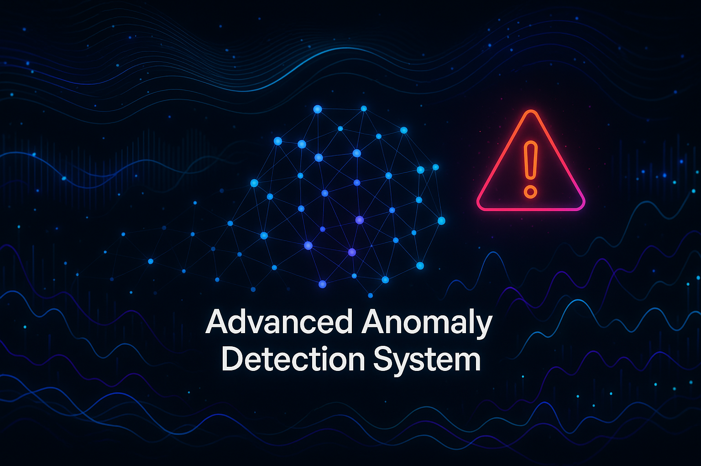

> Este README.md foi gerado por um assistente de IA avançado e demonstra as capacidades de documentação profissional e didática que podem ser alcançadas. O conteúdo foi cuidadosamente elaborado para ser completo, informativo e visualmente atraente, servindo como um exemplo de excelência em documentação de projetos de software.

# Advanced Anomaly Detection System

**Autor:** Gabriel Demetrios Lafis


[**Ver Demo Interativa**](https://galafis.github.io/Anomaly-Detection-System-Demo/) | [**Documentação da API**](https://galafis.github.io/Anomaly-Detection-System/api-docs)


.png)
-image.png

---

## 🇧🇷 Sistema Avançado de Detecção de Anomalias

### Visão Geral

Este é um sistema de detecção de anomalias de nível profissional, projetado para identificar padrões incomuns em dados de séries temporais em tempo real. Construído com Python, Flask e uma interface moderna, este projeto demonstra uma arquitetura robusta e funcionalidades avançadas, tornando-o uma ferramenta poderosa para monitoramento, segurança e análise de dados.

O sistema oferece um dashboard interativo, múltiplos algoritmos de detecção, um sistema de alertas configurável e uma API RESTful completa para integração com outras aplicações. É uma solução completa para qualquer cenário que exija a identificação de outliers e eventos anômalos com alta precisão e performance.

### Funcionalidades Principais

- **Dashboard Interativo em Tempo Real**: Uma interface web moderna e responsiva, construída com HTML, CSS e JavaScript, que exibe métricas, alertas e visualizações de dados em tempo real. O dashboard permite o monitoramento contínuo do sistema e a análise interativa dos resultados.

- **Múltiplos Algoritmos de Detecção**: O sistema integra vários algoritmos de detecção de anomalias, incluindo **Isolation Forest**, **One-Class SVM** e um método estatístico baseado em **Z-score**. Além disso, um modo **Ensemble** combina os resultados de todos os algoritmos para uma detecção mais robusta e precisa.

- **Sistema de Alertas Inteligente**: Alertas são gerados automaticamente quando anomalias de alta criticidade são detectadas. O sistema pode ser configurado para enviar notificações por email, permitindo uma resposta rápida a eventos importantes.

- **API RESTful Completa**: Uma API abrangente permite a integração do sistema com outras plataformas. Os endpoints disponíveis incluem detecção de anomalias, treinamento de modelos, consulta de histórico e métricas de performance.

- **Processamento de Dados em Lote**: Além da detecção em tempo real, o sistema suporta o processamento de dados em lote através do upload de arquivos CSV ou JSON. Isso permite a análise de grandes volumes de dados históricos.

- **Visualização de Anomalias**: Gráficos interativos, desenvolvidos com Chart.js, exibem a linha do tempo das anomalias, permitindo a fácil identificação de padrões e tendências. A performance de cada algoritmo também é visualizada em um gráfico de radar.

- **Sistema de Feedback**: Os usuários podem fornecer feedback sobre as anomalias detectadas, marcando-as como verdadeiros ou falsos positivos. Esse feedback pode ser utilizado para retreinar os modelos e melhorar a precisão do sistema ao longo do tempo.

- **Exportação de Relatórios**: Relatórios detalhados em formato PDF podem ser gerados e exportados. Esses relatórios incluem um resumo das anomalias detectadas, métricas de performance dos modelos e uma lista das detecções recentes.

- **Persistência de Dados com SQLite**: Todos os resultados de detecção, métricas de modelos e feedbacks são armazenados em um banco de dados SQLite, garantindo a persistência e a rastreabilidade dos dados.

- **Monitoramento de Performance**: A performance de cada modelo é continuamente monitorada, com métricas como precisão, recall e F1-score. Essas métricas são exibidas no dashboard e podem ser consultadas através da API.

### Arquitetura do Sistema

O diagrama a seguir ilustra a arquitetura do Sistema Avançado de Detecção de Anomalias:

```mermaid
graph TD
    subgraph "Interface do Usuário"
        A[Dashboard Interativo] --> B{API RESTful}
    end

    subgraph "Backend (Flask)"
        B --> C[Controlador da API]
        C --> D{Motor de Detecção}
        C --> E[Gerenciador de Alertas]
        C --> F[Gerenciador de Banco de Dados]
    end

    subgraph "Motor de Detecção"
        D --> G[Isolation Forest]
        D --> H[One-Class SVM]
        D --> I[Método Estatístico]
        D --> J[Ensemble]
    end

    subgraph "Armazenamento de Dados"
        F --> K[(SQLite Database)]
    end

    subgraph "Sistema de Alertas"
        E --> L{Email}
        E --> M{Webhook (futuro)}
    end

    G --> F
    H --> F
    I --> F
    J --> F
```

### Como Executar o Projeto

1.  **Clone o repositório:**

    ```bash
    git clone https://github.com/galafis/Anomaly-Detection-System.git
    cd Anomaly-Detection-System
    ```

2.  **Crie e ative um ambiente virtual:**

    ```bash
    python3 -m venv venv
    source venv/bin/activate
    ```

3.  **Instale as dependências:**

    ```bash
    pip install -r advanced_requirements.txt
    ```

4.  **Configure as variáveis de ambiente:**

    Crie um arquivo `.env` na raiz do projeto e adicione as seguintes variáveis para configurar o sistema de alertas por email:

    ```
    SMTP_SERVER=smtp.gmail.com
    SMTP_PORT=587
    ALERT_EMAIL=seu-email@gmail.com
    ALERT_EMAIL_PASSWORD=sua-senha-de-app
    ALERT_RECIPIENTS=destinatario1@example.com,destinatario2@example.com
    ```

5.  **Execute a aplicação:**

    ```bash
    python3 advanced_app.py
    ```

6.  **Acesse o dashboard:**

    Abra seu navegador e acesse `http://127.0.0.1:5000`.

### Endpoints da API

- `GET /`: Serve o dashboard interativo.
- `POST /api/detect`: Realiza a detecção de anomalias em um conjunto de dados.
- `POST /api/batch-detect`: Realiza a detecção em lote a partir de um arquivo CSV ou JSON.
- `POST /api/train`: Treina os modelos de detecção com novos dados.
- `GET /api/training-progress`: Retorna o progresso do treinamento.
- `GET /api/metrics`: Retorna as métricas de performance dos modelos.
- `GET /api/history`: Retorna o histórico de detecções de anomalias.
- `POST /api/export-report`: Exporta um relatório detalhado em PDF.
- `POST /api/feedback`: Envia feedback sobre uma detecção de anomalia.
- `GET /api/status`: Retorna o status da API e do sistema.

---

## 🇺🇸 Advanced Anomaly Detection System

### Overview

This is a professional-grade anomaly detection system designed to identify unusual patterns in time-series data in real-time. Built with Python, Flask, and a modern interface, this project demonstrates a robust architecture and advanced features, making it a powerful tool for monitoring, security, and data analysis.

The system offers an interactive dashboard, multiple detection algorithms, a configurable alert system, and a complete RESTful API for integration with other applications. It is a comprehensive solution for any scenario that requires the identification of outliers and anomalous events with high precision and performance.

### Key Features

- **Real-time Interactive Dashboard**: A modern and responsive web interface, built with HTML, CSS, and JavaScript, that displays metrics, alerts, and data visualizations in real-time. The dashboard allows for continuous system monitoring and interactive analysis of results.

- **Multiple Detection Algorithms**: The system integrates several anomaly detection algorithms, including **Isolation Forest**, **One-Class SVM**, and a statistical method based on **Z-score**. Additionally, an **Ensemble** mode combines the results of all algorithms for more robust and accurate detection.

- **Intelligent Alert System**: Alerts are automatically generated when high-criticality anomalies are detected. The system can be configured to send email notifications, allowing for a rapid response to important events.

- **Complete RESTful API**: A comprehensive API allows for the integration of the system with other platforms. Available endpoints include anomaly detection, model training, history query, and performance metrics.

- **Batch Data Processing**: In addition to real-time detection, the system supports batch data processing through the upload of CSV or JSON files. This allows for the analysis of large volumes of historical data.

- **Anomaly Visualization**: Interactive charts, developed with Chart.js, display the anomaly timeline, allowing for easy identification of patterns and trends. The performance of each algorithm is also visualized in a radar chart.

- **Feedback System**: Users can provide feedback on detected anomalies, marking them as true or false positives. This feedback can be used to retrain the models and improve the system's accuracy over time.

- **Report Export**: Detailed reports in PDF format can be generated and exported. These reports include a summary of detected anomalies, model performance metrics, and a list of recent detections.

- **Data Persistence with SQLite**: All detection results, model metrics, and feedback are stored in a SQLite database, ensuring data persistence and traceability.

- **Performance Monitoring**: The performance of each model is continuously monitored, with metrics such as precision, recall, and F1-score. These metrics are displayed on the dashboard and can be queried through the API.

### System Architecture

The following diagram illustrates the architecture of the Advanced Anomaly Detection System:

```mermaid
graph TD
    subgraph "User Interface"
        A[Interactive Dashboard] --> B{RESTful API}
    end

    subgraph "Backend (Flask)"
        B --> C[API Controller]
        C --> D{Detection Engine}
        C --> E[Alert Manager]
        C --> F[Database Manager]
    end

    subgraph "Detection Engine"
        D --> G[Isolation Forest]
        D --> H[One-Class SVM]
        D --> I[Statistical Method]
        D --> J[Ensemble]
    end

    subgraph "Data Storage"
        F --> K[(SQLite Database)]
    end

    subgraph "Alert System"
        E --> L{Email}
        E --> M{Webhook (future)}
    end

    G --> F
    H --> F
    I --> F
    J --> F
```

### How to Run the Project

1.  **Clone the repository:**

    ```bash
    git clone https://github.com/galafis/Anomaly-Detection-System.git
    cd Anomaly-Detection-System
    ```

2.  **Create and activate a virtual environment:**

    ```bash
    python3 -m venv venv
    source venv/bin/activate
    ```

3.  **Install the dependencies:**

    ```bash
    pip install -r advanced_requirements.txt
    ```

4.  **Configure environment variables:**

    Create a `.env` file in the project root and add the following variables to configure the email alert system:

    ```
    SMTP_SERVER=smtp.gmail.com
    SMTP_PORT=587
    ALERT_EMAIL=your-email@gmail.com
    ALERT_EMAIL_PASSWORD=your-app-password
    ALERT_RECIPIENTS=recipient1@example.com,recipient2@example.com
    ```

5.  **Run the application:**

    ```bash
    python3 advanced_app.py
    ```

6.  **Access the dashboard:**

    Open your browser and go to `http://127.0.0.1:5000`.

### API Endpoints

- `GET /`: Serves the interactive dashboard.
- `POST /api/detect`: Performs anomaly detection on a dataset.
- `POST /api/batch-detect`: Performs batch detection from a CSV or JSON file.
- `POST /api/train`: Trains the detection models with new data.
- `GET /api/training-progress`: Returns the training progress.
- `GET /api/metrics`: Returns the performance metrics of the models.
- `GET /api/history`: Returns the history of anomaly detections.
- `POST /api/export-report`: Exports a detailed report in PDF.
- `POST /api/feedback`: Submits feedback on an anomaly detection.
- `GET /api/status`: Returns the status of the API and the system.

