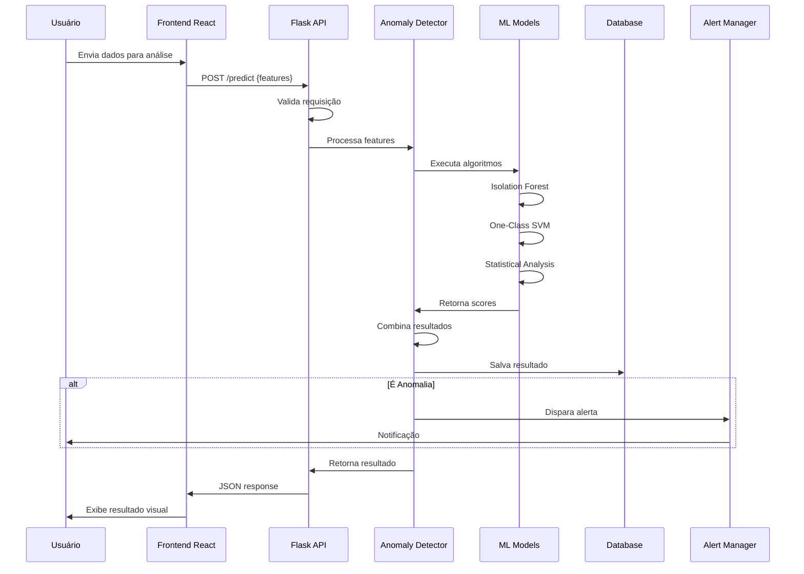
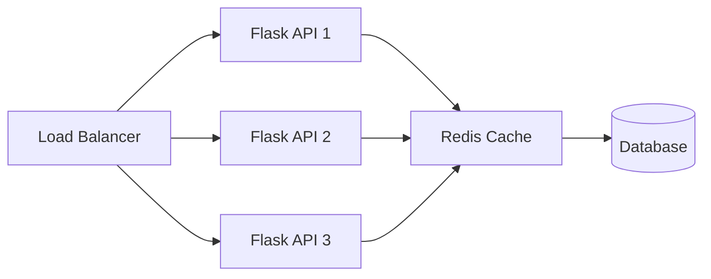
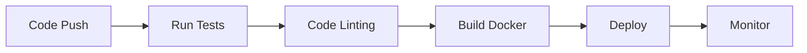

# Arquitetura do Sistema de Detecção de Anomalias

## 🏗️ Visão Geral da Arquitetura

O Sistema de Detecção de Anomalias segue uma arquitetura moderna de três camadas (Frontend, Backend, Dados) com componentes modulares e escaláveis.

## 📐 Diagrama de Arquitetura Completa

```mermaid
graph TB
    subgraph "Frontend Layer - React Application"
        UI[Dashboard Interface]
        VIZ[Data Visualization]
        CTRL[Control Panel]
        ALERT[Alert Display]
    end
    
    subgraph "API Gateway Layer"
        GATE[Flask API Gateway]
        AUTH[Authentication Middleware]
        VALID[Request Validator]
    end
    
    subgraph "Business Logic Layer"
        DET[Anomaly Detector Service]
        ALT[Alert Manager Service]
        DB_MGR[Database Manager]
        REP[Report Generator]
    end
    
    subgraph "ML Pipeline"
        PREP[Data Preprocessor]
        ISO[Isolation Forest]
        SVM[One-Class SVM]
        STAT[Statistical Methods]
        ENS[Ensemble Combiner]
    end
    
    subgraph "Data Layer"
        SQL[(SQLite Database)]
        REDIS[(Redis Cache)]
        FILES[Model Files .pkl]
    end
    
    subgraph "External Services"
        EMAIL[Email Service]
        WEBHOOK[Webhook Service]
    end
    
    UI --> GATE
    VIZ --> GATE
    CTRL --> GATE
    GATE --> AUTH
    AUTH --> VALID
    VALID --> DET
    VALID --> ALT
    VALID --> DB_MGR
    
    DET --> PREP
    PREP --> ISO
    PREP --> SVM
    PREP --> STAT
    ISO --> ENS
    SVM --> ENS
    STAT --> ENS
    
    ENS --> DB_MGR
    DB_MGR --> SQL
    DB_MGR --> REDIS
    
    DET --> FILES
    DET --> ALT
    ALT --> EMAIL
    ALT --> WEBHOOK
    
    DET --> REP
    REP --> ALERT
    
    style UI fill:#e3f2fd
    style GATE fill:#f3e5f5
    style DET fill:#e8f5e9
    style SQL fill:#fff3e0
    style REDIS fill:#fce4ec
```



## 🔄 Fluxo de Dados Detalhado



## 📦 Componentes do Sistema

### 1. Frontend (React + Vite)

**Tecnologias:**
- React 18+
- Vite 6.x
- TailwindCSS 3.x
- Chart.js 3.x
- Shadcn/ui components

**Responsabilidades:**
- Interface de usuário interativa
- Visualização de dados em tempo real
- Controle de algoritmos ML
- Exibição de alertas e notificações

**Componentes Principais:**
```
frontend/
├── src/
│   ├── components/
│   │   ├── Dashboard.jsx
│   │   ├── AnomalyChart.jsx
│   │   ├── ControlPanel.jsx
│   │   └── AlertPanel.jsx
│   ├── hooks/
│   │   ├── useDetection.js
│   │   └── useWebSocket.js
│   └── App.jsx
```

### 2. Backend (Flask API)

**Tecnologias:**
- Python 3.9+
- Flask 2.0+
- Flask-CORS
- SQLAlchemy

**Responsabilidades:**
- API RESTful
- Gerenciamento de requisições
- Coordenação de serviços
- Autenticação e autorização

**Estrutura:**
```
src/
├── api/
│   ├── app.py              # API principal
│   └── simple_app.py       # API simplificada
├── models/
│   └── data_models.py      # Modelos de dados
├── services/
│   ├── anomaly_detector.py
│   ├── alert_manager.py
│   └── database_manager.py
└── utils/
```

### 3. Camada de Machine Learning

**Algoritmos Implementados:**

#### Isolation Forest
- Detecção baseada em isolamento
- Eficiente para datasets grandes
- Detecta anomalias por particionamento

#### One-Class SVM
- Support Vector Machine de uma classe
- Aprende fronteira de normalidade
- Bom para dados de alta dimensão

#### Métodos Estatísticos
- Z-Score
- IQR (Interquartile Range)
- Detecção por desvio padrão

#### Ensemble Learning
- Combina múltiplos algoritmos
- Votação ponderada
- Maior precisão e robustez

**Pipeline ML:**
```python
1. Preprocessamento
   ↓
2. Feature Engineering
   ↓
3. Normalização
   ↓
4. Execução Paralela de Algoritmos
   ↓
5. Combinação de Resultados
   ↓
6. Classificação Final
```

### 4. Camada de Dados

#### SQLite Database
- Armazena resultados de detecção
- Histórico de alertas
- Métricas de performance

#### Redis Cache
- Cache de resultados recentes
- Sessões de usuário
- Dados temporários

#### Model Storage
- Modelos .pkl serializados
- Versionamento de modelos
- Checkpoint de treinamento

### 5. Sistema de Alertas

**Canais de Notificação:**
- Email (SMTP)
- Webhooks (HTTP POST)
- In-app notifications

**Níveis de Alerta:**
- 🟢 LOW: Anomalias leves
- 🟡 MEDIUM: Anomalias moderadas
- 🟠 HIGH: Anomalias significativas
- 🔴 CRITICAL: Anomalias críticas

## 🔐 Segurança

### Autenticação
- JWT tokens
- API key authentication
- Rate limiting

### Validação
- Input sanitization
- Schema validation
- Type checking

### Proteção
- CORS configurado
- SQL injection prevention
- XSS protection

## 📊 Escalabilidade

### Horizontal Scaling


### Estratégias de Otimização
1. **Caching**: Redis para resultados frequentes
2. **Async Processing**: Celery para tarefas pesadas
3. **Database Indexing**: Índices em campos críticos
4. **Model Optimization**: Quantização e pruning

## 🔄 CI/CD Pipeline



### Etapas:
1. **Code Quality**: ESLint, Pylint, Black
2. **Testing**: Pytest, Jest
3. **Build**: Docker multi-stage builds
4. **Deploy**: Docker Compose / Kubernetes
5. **Monitor**: Prometheus + Grafana

## 📈 Monitoramento e Observabilidade

### Métricas Coletadas
- Latência de predições
- Taxa de anomalias detectadas
- Uso de recursos (CPU, RAM)
- Taxa de erro de requisições

### Logs
- Estruturados em JSON
- Níveis: DEBUG, INFO, WARNING, ERROR, CRITICAL
- Armazenamento: ElasticSearch / CloudWatch

### Alertas de Sistema
- CPU > 80%
- Memória > 90%
- Taxa de erro > 5%
- Latência > 1s

## 🚀 Deployment

### Docker Compose
```yaml
services:
  frontend:
    build: ./frontend
    ports: ["5173:5173"]
  
  backend:
    build: ./
    ports: ["5000:5000"]
    depends_on:
      - redis
      - db
  
  redis:
    image: redis:alpine
    
  db:
    image: postgres:14
```

### Kubernetes (Produção)
```yaml
apiVersion: apps/v1
kind: Deployment
metadata:
  name: anomaly-detection-api
spec:
  replicas: 3
  selector:
    matchLabels:
      app: anomaly-api
  template:
    metadata:
      labels:
        app: anomaly-api
    spec:
      containers:
      - name: api
        image: anomaly-detection:latest
        ports:
        - containerPort: 5000
```

## 📚 Referências

- [Isolation Forest Paper](https://cs.nju.edu.cn/zhouzh/zhouzh.files/publication/icdm08b.pdf)
- [One-Class SVM](https://scikit-learn.org/stable/modules/svm.html#svm-outlier-detection)
- [Flask Documentation](https://flask.palletsprojects.com/)
- [React Documentation](https://react.dev/)

---

**Autor:** Gabriel Demetrios Lafis  
**Versão:** 1.0.0  
**Última Atualização:** Outubro 2024
